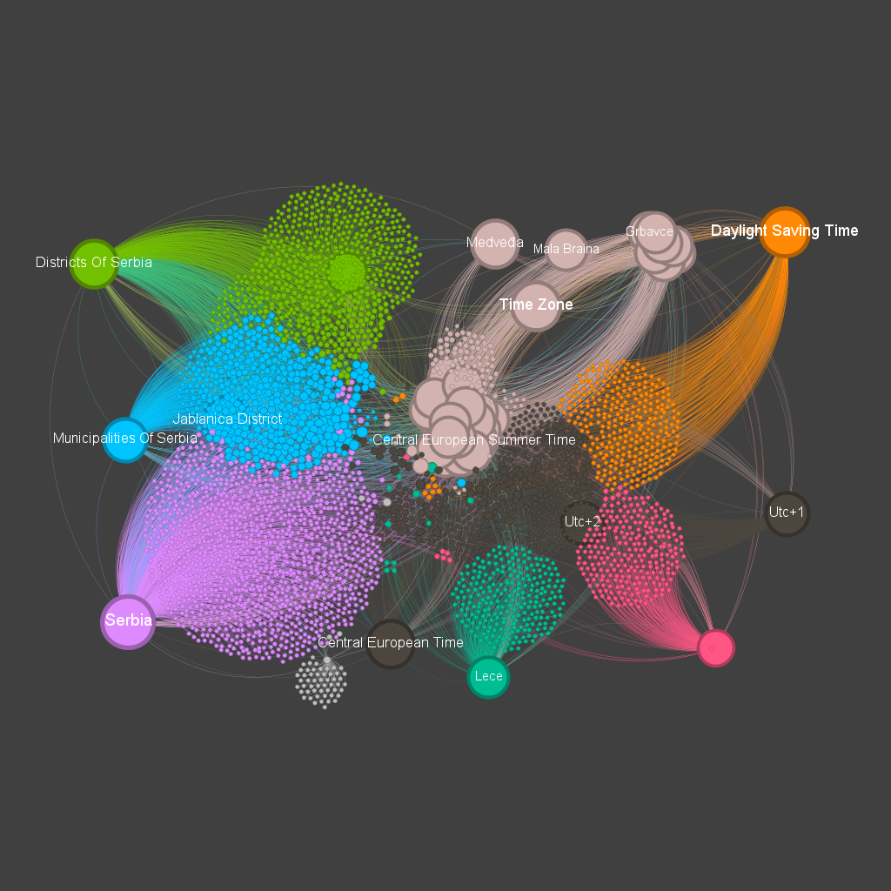
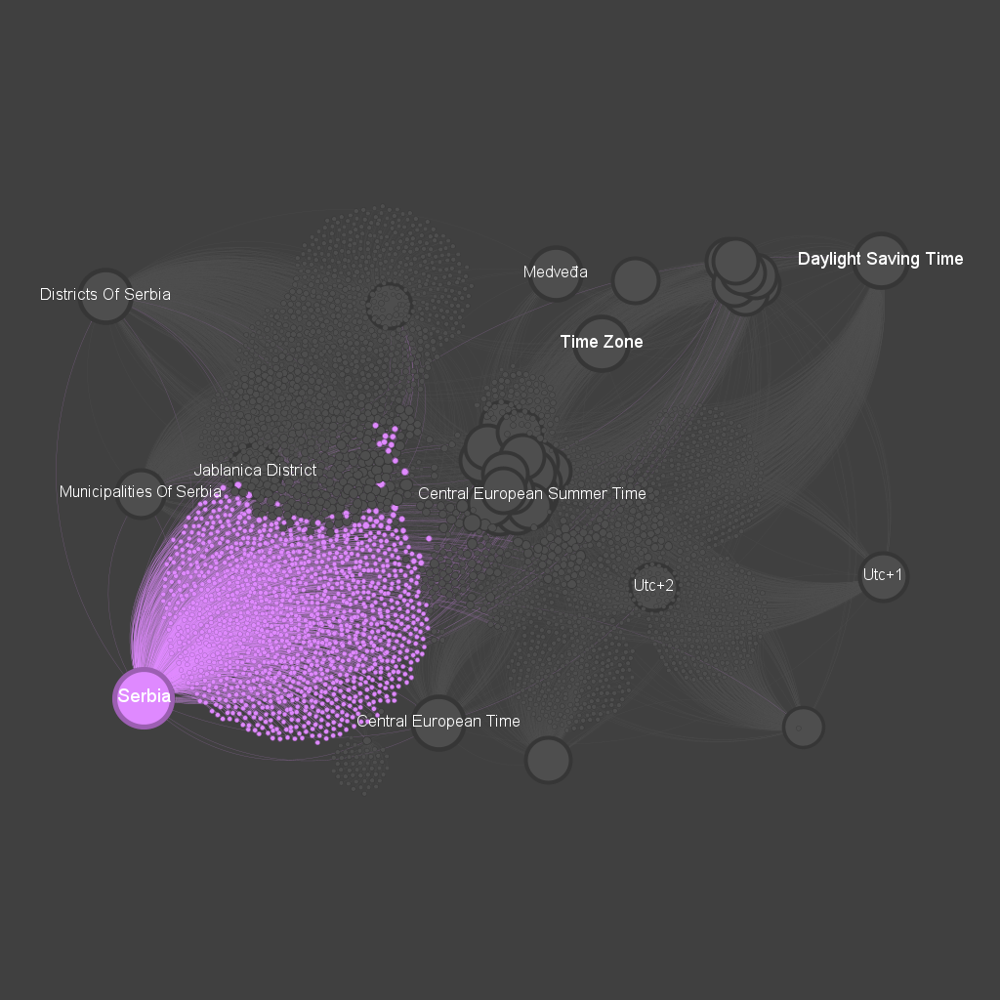

# GraphDeploy
Group Members: Lucas Morais, João Gabriel, João Madruga
Final project of the algorithms and data structures course. 
Graph generated from a wikipedia network and virtualized using gephi  
Link to visualize: https://joaogabrielra.github.io/graphdeploy/network/  
Link to a explanation video: https://www.loom.com/share/983f23e619d0499b8ded9aa2717a1cb7?sid=85d4817b-64b3-4b1b-822a-5aea649dadb1
  
  
  

